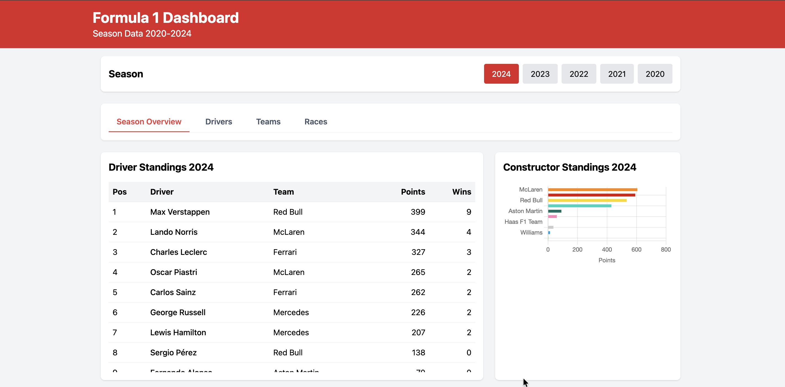
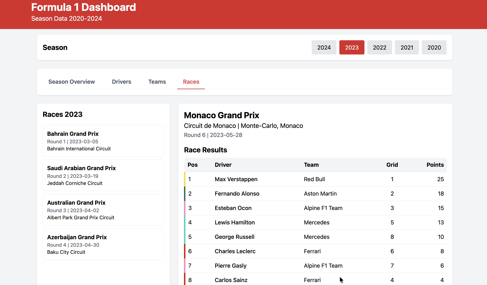
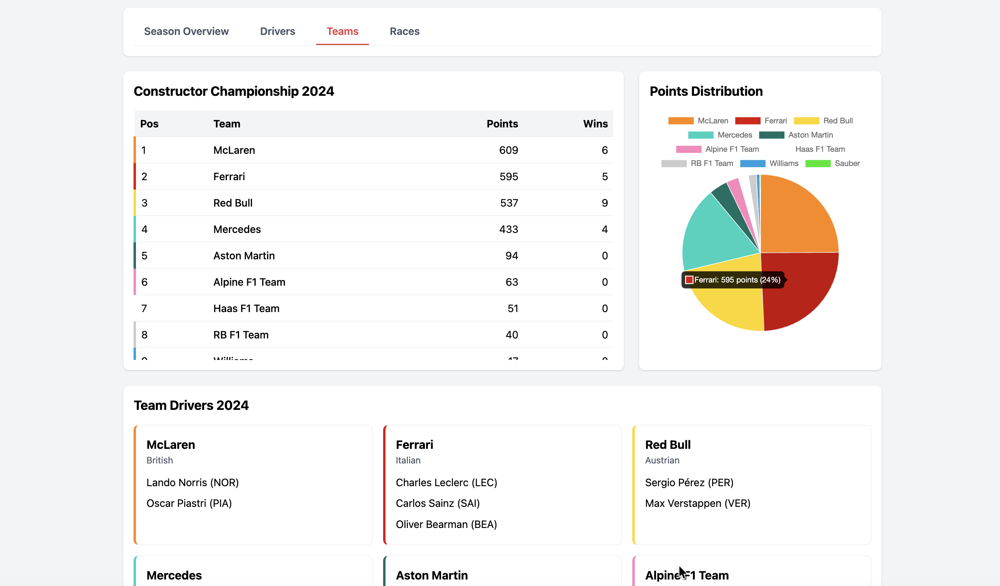
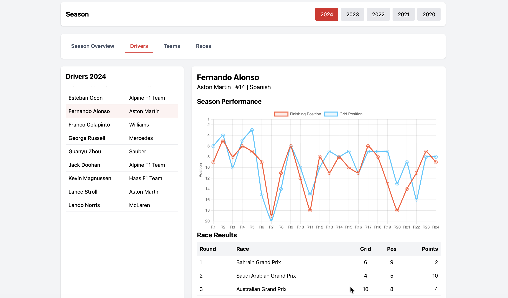
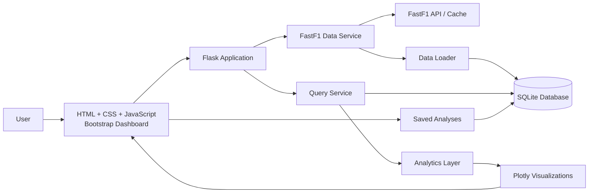

<div align="center">

# 🏎️ Formula 1 Data Analysis Dashboard

### Explore race pace, tire strategy, qualifying, weather, standings, and team performance across the 2023 and 2024 Formula 1 seasons.

A full-stack analytics dashboard built with **Flask, FastF1, Plotly, SQLite, JavaScript, and Bootstrap**.

[Demo](#-one-minute-demo) · [Features](#-features) · [Analytics](#-analytics) · [Quick Start](#-quick-start)

<br />


</div>

---

## 🏁 Overview

The Formula 1 Data Analysis Dashboard transforms race data into interactive visual stories.

Users can select a season and Grand Prix, compare driver pace, inspect tire degradation, study qualifying consistency, analyze weather impact, review team podium performance, and save custom analyses for later.

The dashboard currently supports the **2023 and 2024 Formula 1 seasons**.

---

## 🎬 One-minute demo

<p align="center">
  <a href="https://drive.google.com/file/d/1mzVdEZZwFLwwuQJYEcir7mBiYbF8HXCy/view?usp=sharing">
    
  </a>
</p>

<p align="center">
  <strong>▶ Click the preview to watch the one-minute demo</strong>
</p>

---

## ✨ Features

### Race analysis

- Compare average lap times between drivers
- Explore race-by-race pace differences
- Analyze tire age and compound performance
- Review changing track and weather conditions

### Season analysis

- Compare team podium totals
- Track average qualifying positions
- Review driver and constructor standings
- Identify performance trends across the season

### Interactive experience

- Dynamic Plotly visualizations
- Season and race filters
- Driver and team selectors
- Saved custom analyses
- Responsive Bootstrap interface
- FastF1-backed race data

---

## 📊 Analytics

### Driver lap-time comparison

Compare average lap times for selected drivers in a specific Grand Prix to identify pace differences and race-performance patterns.

### Tire strategy analysis

Explore how tire age and compound choice affect lap times, revealing degradation trends and team-specific strategy differences.

### Team podium analysis

Compare podium finishes across constructors to evaluate consistency throughout a season.

### Qualifying performance

Track average driver qualifying positions across races and identify changes in one-lap performance.

### Weather impact analysis

Study how track and weather conditions affect lap times and driver performance.

### Championship standings

Review driver and constructor standings directly within the dashboard.

---

## 🖼️ Dashboard preview

### Race results and season navigation

<p align="center">
  
</p>

### Constructor standings and points distribution

<p align="center">
  
</p>

### Driver season performance

<p align="center">
  
</p>

---

## 🏗️ Architecture



### Data flow

```text
FastF1 data
   → clean and normalize
   → store in SQLite
   → query by season, race, driver, or team
   → calculate analytics
   → render interactive Plotly charts
   → display results in the dashboard
```

---

## 🛠️ Tech stack

| Layer | Technology | Responsibility |
|---|---|---|
| Backend | Python, Flask | Routing, data processing, dashboard APIs |
| Data source | FastF1 | Formula 1 sessions, laps, standings, weather, and telemetry data |
| Database | SQLite | Locally stored race data and saved analyses |
| Frontend | HTML, CSS, JavaScript | Dashboard interface and interactions |
| Visualization | Plotly | Interactive charts and comparisons |
| UI framework | Bootstrap 5 | Responsive layouts and components |

---

## ⚡ Quick start

### Prerequisites

- Python 3.8 or newer
- Git

### 1. Clone the repository

```bash
git clone https://github.com/gauri2029/F1-Data-Analysis-Dashboard.git
cd F1-Data-Analysis-Dashboard
```

### 2. Create a virtual environment

#### macOS or Linux

```bash
python -m venv venv
source venv/bin/activate
```

#### Windows

```bash
python -m venv venv
venv\Scripts\activate
```

### 3. Install dependencies

```bash
pip install -r requirements.txt
```

### 4. Initialize the database

```bash
python -m database.data_loader
```

> The first load may take several minutes because FastF1 downloads and processes race data for the supported seasons.

### 5. Start the application

```bash
python app.py
```

Open:

```text
http://localhost:5000
```

---

## 🧭 Using the dashboard

1. Select a Formula 1 season
2. Choose a Grand Prix
3. Open the desired analysis view
4. Select drivers, teams, or conditions
5. Interact with the generated Plotly chart
6. Save the analysis for future reference

---

## 📁 Project structure

```text
F1-Data-Analysis-Dashboard/
├── app.py
├── requirements.txt
├── database/
│   ├── db_setup.py
│   ├── schema.sql
│   └── data_loader.py
├── services/
│   ├── f1_data_service.py
│   └── query_service.py
├── static/
│   ├── css/
│   │   └── style.css
│   └── js/
│       └── dashboard.js
├── templates/
│   └── index.html
├── cache/
└── docs/
    └── assets/
        ├── f1-dashboard-demo.mp4
        ├── f1-dashboard-preview.png
        ├── dashboard-overview.png
        ├── lap-comparison.png
        └── tire-strategy.png
```

---

## 🧠 Design decisions

| Decision | Reason |
|---|---|
| FastF1 | Provides structured access to Formula 1 timing, lap, weather, and session data |
| SQLite | Lightweight local persistence without requiring an external database |
| Flask | Simple backend architecture for data queries and dashboard routes |
| Plotly | Interactive charts with hover, zoom, filtering, and responsive rendering |
| Cached race data | Reduces repeated API calls and improves local dashboard performance |
| Saved analyses | Lets users preserve useful race and season comparisons |

---

## 🔧 Troubleshooting

### Database errors

Delete the generated database and reload the data:

```bash
rm database/f1_database.db
python -m database.data_loader
```

### FastF1 download issues

FastF1 requests may occasionally fail or take longer than expected. Wait briefly and rerun the loader.

### Charts do not display

- Check the browser console for JavaScript errors
- Confirm that the Flask server is running
- Clear the browser cache
- Try another supported browser

---

## 👥 Contributors

This project was developed as a team coursework project.

- **Gauri Markandey**
- **Krisha Elle**
- **Suraj Iyer**

---

## 🙌 Acknowledgments

- [FastF1](https://github.com/theOehrly/Fast-F1) for Formula 1 timing and session data
- [Plotly](https://plotly.com/) for interactive visualization
- Formula 1 for the underlying race data

---

## 📄 License

This project is available under the [MIT License](LICENSE).

---

<div align="center">

### Lights out — and away we analyze. 🏁

</div>
